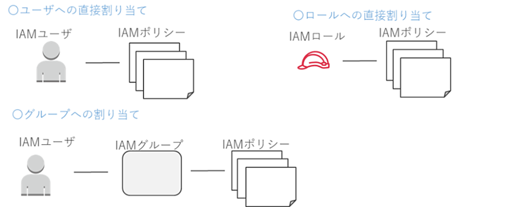

# IAM
- [IAM](#iam)
  - [概要](#概要)
    - [基本要素](#基本要素)
    - [ポリシー詳細](#ポリシー詳細)
      - [ポリシーの注意点](#ポリシーの注意点)
  - [tips](#tips)
  - [参考](#参考)
  - [version](#version)

:::note info
インフォメーション
infoは省略可能です。
:::

:::note warn
警告
○○に注意してください。
:::

:::note alert
より強い警告
○○しないでください。
:::


<a id="概要"></a>
## 概要
Identity and Access Management

誰であるか、何ができるかを管理するもの

<a id="基本要素"></a>
### 基本要素

1. IAMユーザ
  AWSリソースを操作するための固有のID
2. IAMグループ
  IAMポリシーをまとめたもの
3. IAMロール
  AWSリソースやユーザに一時的なアクセス権限を付与する仕組み
4. IAMポリシー
  権限を定義しているもの

* 「AWS管理」のIAMポリシー
  事前にAWSが権限を設定してあるポリシー、基本的にメンテいらず
* 「カスタマー管理」のIAMポリシー
  ユーザが自分で権限を設定するポリシー

**よく使われるポリシー**
* AdministratorAccess
* PowerUserAccess
* ReadOnlyAccess
* [サービス]FullAccess, [サービス]Readolny

<a id="ポリシー詳細"></a>
### ポリシー詳細
IAMポリシーについてはすべて利用可能なAPIをjson形式にて記載

ポリシーの基本構成は以下
1. Action
   操作(API)についての定義
2. Resource
   対象(AWSサービス)についての定義
3. Effect
   許可、もしくは拒否
4. Condition
   条件式

**例(AdministratorAccess)**
```json
{
    "Version": "2012-10-17",
    "Statement": [
        {
            "Effect": "Allow",
            "Action": "*",
            "Resource": "*"
        }
    ]
}
```
#### ポリシーの注意点
1. 許可より拒否が優先
2. Condition句の利用について制限がある

各要素の関係性は以下のような形


<a id="tips"></a>
## tips

<a id="参考"></a>
## 参考
[](https://)

## version
