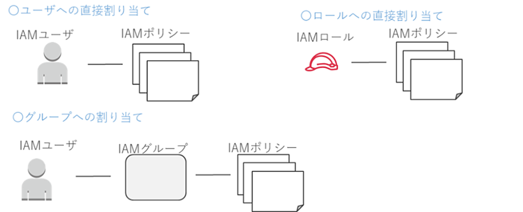
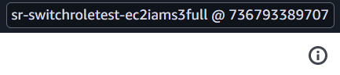
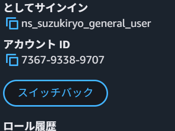

# IAM
- [IAM](#iam)
  - [概要](#概要)
    - [基本要素](#基本要素)
    - [ポリシー詳細](#ポリシー詳細)
      - [ポリシーの注意点](#ポリシーの注意点)
    - [ユーザ詳細](#ユーザ詳細)
    - [ロール詳細](#ロール詳細)
  - [tips](#tips)
  - [参考](#参考)
  - [version](#version)

:::note info
インフォメーション
infoは省略可能です。
:::

:::note warn
警告
○○に注意してください。
:::

:::note alert
より強い警告
○○しないでください。
:::


<a id="概要"></a>
## 概要
Identity and Access Management

誰であるか、何ができるかを管理するもの

<a id="基本要素"></a>
### 基本要素

1. IAMユーザ
  AWSリソースを操作するための固有のID
2. IAMグループ
  IAMポリシーをまとめたもの
3. IAMロール
  AWSリソースやユーザに一時的なアクセス権限を付与する仕組み
4. IAMポリシー
  権限を定義しているもの

* 「AWS管理」のIAMポリシー
  事前にAWSが権限を設定してあるポリシー、基本的にメンテいらず
* 「カスタマー管理」のIAMポリシー
  ユーザが自分で権限を設定するポリシー

**よく使われるポリシー**
* AdministratorAccess
* PowerUserAccess
* ReadOnlyAccess
* [サービス]FullAccess, [サービス]Readolny

<a id="ポリシー詳細"></a>
### ポリシー
IAMポリシーについてはすべて利用可能なAPIをjson形式にて記載

ポリシーの基本構成は以下
1. Action
   操作(API)についての定義
2. Resource
   対象(AWSサービス)についての定義
3. Effect
   許可、もしくは拒否
4. Condition
   条件式

**例(AdministratorAccess)**
```json
{
    "Version": "2012-10-17",
    "Statement": [
        {
            "Effect": "Allow",
            "Action": "*",
            "Resource": "*"
        }
    ]
}
```
#### ポリシーの注意点
1. 許可より拒否が優先
2. Condition句の利用について制限がある

各要素の関係性は以下のような形


<a id="ユーザ詳細"></a>
### ユーザ

#### スイッチロール
複数のアカウント間で作業をする際にアカウントの切り替えをスムーズに行うための機能
[ロール](#ロール詳細) も併せて参照

スイッチ元のアカウントでの準備
* ロールを引き受ける許可用のポリシー
```
{
    "Version": "2012-10-17",
    "Statement": {
        "Effect": "Allow",
        "Action": "sts:AssumeRole",
        "Resource": "arn:aws:iam::<スイッチ先のAWSアカウントID>:role/TestSwitchRole"
    }
}
```
スイッチロール後はロール名が表示される


作業完了後はスイッチバックを行う


<a id="ロール詳細"></a>
### ロール

#### ロールの信頼関係
どのエンティティがこのロールへのスイッチを可能とするかを定義する
```
{
    "Version": "2012-10-17",
    "Statement": [
        {
            "Effect": "Allow",
            "Principal": {
                "Service": "ec2.amazonaws.com"
            },
            "Action": "sts:AssumeRole"
        }
    ]
}
```
"Effect"をAllowとすることで明示的に許可
"Principal"でサービス、ARN等を指定
"Action": "sts:AssumeRole"はIAMロールを引き受けるための操作を許可するもの


<a id="tips"></a>
## tips

<a id="参考"></a>
## 参考
[](https://)

## version
