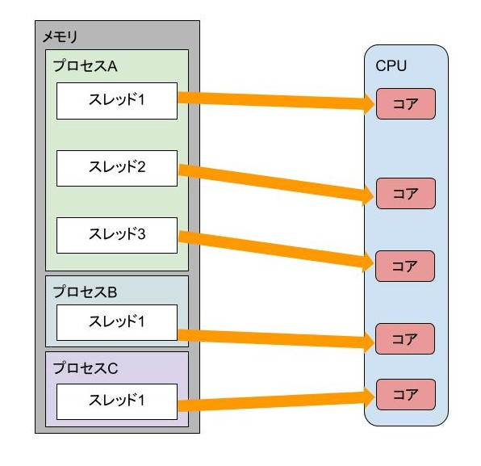

# CPUのコア、スレッドとプロセスの違い、コンテキストスイッチ、マルチスレッディングについて

## CPUコア
最近のCPUは、1つのCPUソケットに複数のコア（実際に処理を行う部品）がついている。
CPUコアとは実際に命令を行う部品のことで、SMT登場前においては
**CPUコア数=同時に実行できる命令の数**
だった。

実行中のプログラムは**プロセス**と呼ばれ、プロセスは1つ以上の**スレッド**を持つ。

* スレッドはCPUコアに対して命令を与えることができる
* 1つのプロセス内のスレッドはプログラムのつくり込みにより複数持つことが可能
* プロセスには各々メモリ空間が与えられる。つまり、同一プロセス内のスレッドはメモリ空間を共有できる。

