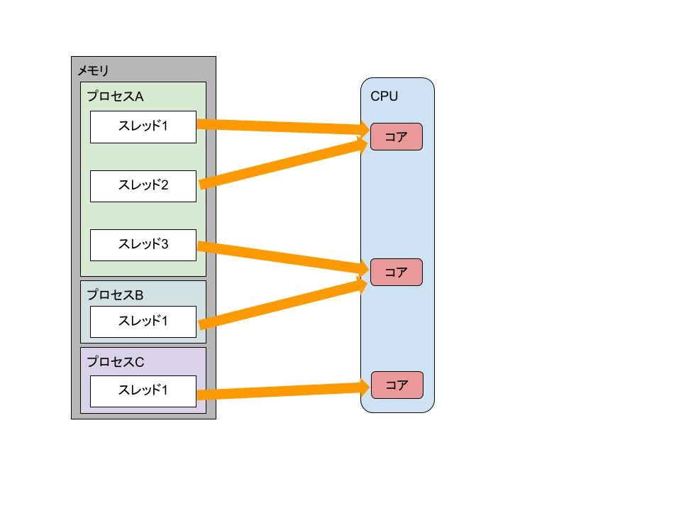

# CPUのコア、スレッドとプロセスの違い、コンテキストスイッチ、マルチスレッディングについて

## CPUコア
最近のCPUは、1つのCPUソケットに複数のコア（実際に処理を行う部品）がついている。
CPUコアとは実際に命令を行う部品のことで、SMT登場前においては
**CPUコア数=同時に実行できる命令の数**
だった。

実行中のプログラムは**プロセス**と呼ばれ、プロセスは1つ以上の**スレッド**を持つ。

* スレッドはCPUコアに対して命令を与えることができる
* 1つのプロセス内のスレッドはプログラムのつくり込みにより複数持つことが可能
* プロセスには各々メモリ空間が与えられる。つまり、同一プロセス内のスレッドはメモリ空間を共有できる。

## プロセスとスレッドの違い
**プロセス**とは**実行中のプログラム**のこと。

1つのプロセスには、1つのメモリ領域が割り当てられます。メモリ領域はプロセスからOSに要求すれば（空きがあれば）増やしてくれる。

**スレッド**とは**プロセス内で命令を逐次実行する部分であり、CPUコアを利用する単位のこと**。

前述のとおり、SMT（同時マルチスレッディング）登場以前は1スレッドに1コアが基本。
最近のCPUは、SMT（Intelではハイパースレッディング）機能を搭載しているモデルが多く、この機能を使うと、1つのコアに対して複数のスレッドを割り当てることができる。

* スレッドは各CPUコアに対して命令を与えることができる
* CPUコアは同時に複数のスレッドからの命令を受けることができる

2スレッドのSMTに対応しているCPUであれば「スレッド数」は「コア数」の倍になる。

## シングルスレッドとマルチスレッド
1つのプロセスで複数のスレッドを使うかどうかは、アプリケーションのつくり方次第。

例えばプロキシソフトのSQUIDはシングルスレッドなのでSQUIDの動作を早めたいと思ってCPUのコアをたくさん搭載しても意味がない。

一方マルチスレッドの場合は1つのプロセス中に複数の処理を並行して行えるので、パフォーマンスが良い傾向にある。

なお、プロセス間でメモリ領域を侵食しないかはOSが管理しますが、マルチスレッドでは、プロセスに割り当てられた1つのメモリ領域を複数のスレッドが共有するので、マルチスレッドアプリケーションがスレッド間で互いにメモリを侵食しないよう、プログラミングする人が意識する必要がある。

## CPUの命令セットアーキテクチャ
現在はx86系が主流。
昔は32ビットOSがあったため、32ビットOS用はx86、64ビットOS用はx64もしくはx86_x64と区別していましたが、現在32ビットOSはほぼなくなったので、_64xと書かなくても「x86=64ビットOS用」を指すこともある。

WindowsやRHELでは現在はx86系のみをサポートしている。

## コンテキストスイッチ
SMTとマルチタスクの違いを整理しておく。
SMTはある習慣で並行して実行されている命令数のことを言っており、マルチタスクは短い時間で並行して実行されているプログラムの数のこと。
マルチタスクは、人間にはわからないほど高速に実行するプログラムを頻繁に切り替えることで実現している。

CPUのContextというのがプロセスに紐づいており、このContextにそのプロセスで最後に実行した状態が記憶されており、また順番が回ってきたらそのContextから情報を引っ張り出し、処理を継続する。

この切り替えのことを**コンテキストスイッチ**と呼ぶ。

コンテキストスイッチはこのプロセスの切り替えだけでなく、ユーザーモードとカーネルモード間の切り替え時にも発生している。
