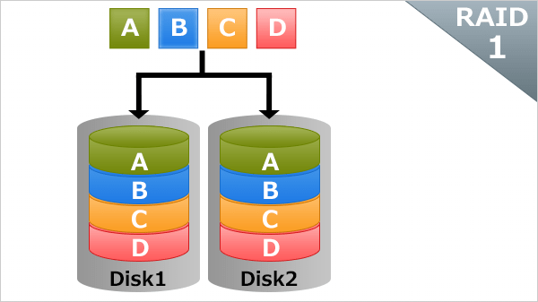

# RAIDとは
サーバ構築において、HDD（もしくはSSD）を冗長化していない場合、1本壊れただけでもサーバがダウンしてしまう可能性がある。
壊れた時のリスクが大きいため、通常はRAIDを使って冗長構成にすることが多い。

RAIDにはハードウェアRAIDとソフトウェアRAIDがあります。ともにOSインストール時であってもインストール後であっても構成できますが、
RAIDを組む時間は長く、ディスクIO負荷がかかっているためサービスイン前に構成してしまうのが良いです。

## ハードウェアRAID
マザーボードとディスクの間にRAIDコントローラというデバイスが入り、OSはRAIDを意識しません。
つまりRAIDコントローラで作られたRAIDグループ(例えば300GBのHDD5本をRAID5で構成した1200GBのボリューム)
はあたかも1つのHDDとして認識します。

パフォーマンスに優れており、コストもさほど高額ではないため、**サーバ構築においてはこちらの選択肢がごく一般的**。

## ソフトウェアRAID
OSはRAIDを意識してデータの書き込み、読み取りを行います。LinuxではMD(Multiple Devices)という仕組みを使って実装できる。
コストはかかりませんが、パフォーマンスに大きな影響が出やすく、サーバ構築ではあまり利用されません。

## RAIDの種類
RAIDにはいろいろな種類がありますが、代表的なものを紹介します。

* RAID0
  ストライピングといい、データをディスクに交互に書いていく方式。冗長性はなく、
  シーケンシャルなIOをランダムアクセス化し、性能を向上させるのが主目的。
  最低2本のディスクが必要。

  

* RAID1
  ミラーリングといい、同じ内容のディスクを2本持つ構成。そのため、本数は必ず2の倍数になる。
  最低2本のディスクが必要。

  また、RAID1構造後にサーバをシャットダウンし、半分のディスクを抜くことでディスクのバックアップを取ることもできます。

  

* RAID4
  最低3本のディスクが必要で、そのうち1本はパリティ専用ディスクとなる。

  通常のRAIDコントローラではサポートしていませんが、NettAppはこのRAID4をDP(ダブルパリティ)として
  パリティ専用ディスクを2つにしつつ、NVRAMによるキャッシュを利用して効率化した特許技術を持っています。

* RAID5
  最低3本のディスクが必要で、RAID4のパリティ専用ディスクをほかのディスクにも分散配置させたRAID4の進化版。
  容量を確保しつつ、1本のディスク障害に耐えうる、そして性能もそれなりに出る、サーバ構築で一番無難な方式。

  

* RAID6
  最低4本のディスクが必要で、RAID5のパリティを1本分から2本分に増やし、2本同時障害にも耐えられる構成です。
  RAID5の進化版。

  RAID5は1台障害が発生した際、リビルド処理により冗長構成の復旧を試みますが、このリビルド処理も負荷が大きい。
  さらに、ディスクが1台壊れたということは周りのディスクも壊れる確率が比較的高く、リビルド中にもう1台ディスクが壊れる
  ということも大いに考えられます。そこで、さらに耐障害性を高めるRAID6が誕生しました。

  RAID5よりもやや性能が劣りますが、RAID1＋0とRAID5による性能さと比較するとほとんど変わりません。

  

* RAID1+0(RAID10)
  RAID1で構成したRAIDグループを1本のディスクと見立て、それをRAID0におり巣トライピングします。
  耐障害性に優れ、パフォーマンスにも優れますが、実容量は物理容量の半分しか使えません。
  少し高めのRAIDコントローラでサポートされます。

  
