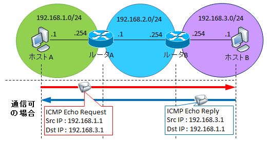
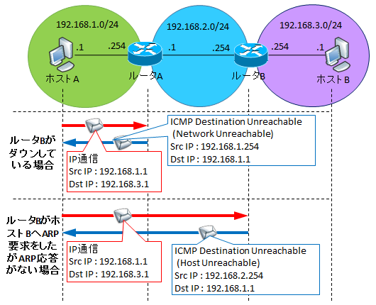
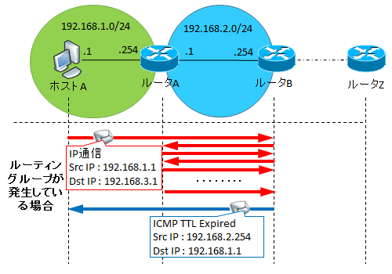
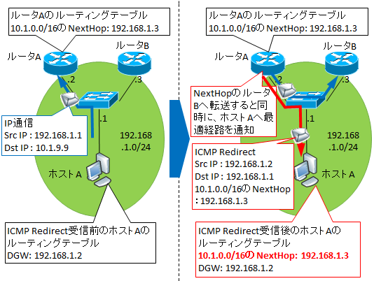

# ICMPとは
ICMPとは**Internet Control Message Protocol**の略で、IP通信の疎通状態を確認したり、
問題があるときにエラー情報を返すIP通信を補助するプロトコルです。

IPを使って動作しますが、IPと同じ**レイヤ3**のプロトコルです。

なお、ICMPはIPヘッダ内のプロトコル番号1です。TCP(プロトコル番号6)やUDP(プロトコル番号17)とは違い、
ポート番号の概念はありません。

その代わり、タイプ番号とコード番号があります。

## pingとの違い
pingはICMPの機能の一部であり、ICMPだからといって、pingとは限りません。

## ICMPの機能
pingの正体は、ICMPの中で一番有名な使われ方である**ping要求(Echo Request)**と **ping応答(Echo Reply)**です。

宛先IPアドレスを指定してping要求を送り、その宛先まで到達できれば送信元へping応答を返します。
これが送信元に戻ってくればIPネットワークとして機能しているということを評価することもできます。

## Destination Unreachable(Type3)
指定した宛先IPまで到達できない場合はこのタイプのICMPが送信元IPに返されます。

例えばIP通信において、経路途中で宛先IPアドレスへの通信が負荷と分かった場合、その判定を行ったネットワーク機器は、
Destination Unreachableと呼ばれるタイプのICMPを送信元IPに送ります。

Destination Unreachableは、Network Unreachable(code0)やHost Unreachable(code1)など、
詳細原因米に個別のcodeを持っています。

これらは、ICMP echoに対してではなく、たとえTCP通信であってもUCP通信であっても、IPアドれるによって通信していて
宛先IPアドレスへの通信が不可であれば、通信ができないと判断したNW機器やホストによりICMPが返されます。
(セキュリティ上の理由であえて返さない設定がされていることもあります)

通常のIP通信は、返信するときは送信元IPと宛先IPを入れ替えて送信しますが、このような(ping以外の)ICMPについてはそうはならず、
送信元IPは「ICMPを生成するNW機器(もしくはホスト)」が保有するIP(返信先へのNextHopとなるインターフェースのIP)となります。

Destination Unreachableとなる主な原因は、宛先IPの危機がARPを返さない、もしくは経路途中のネットワーク機器がARPを返さないといった場合です。

例えばサーバ自体がダウンしていればその手前のルータやL3スイッチがARP解決に失敗したらこのICMPを返しますし、
経路途中のNW機器がダウンしていればやはりその前のルータやL3スイッチがこのICMPを返します。

## Time Exceeded(Type11)
ルーティングループが発生したり、中継危機が多すぎた等の理由で、IPヘッダの中にある**TTL**が1のパケットをルーティングしようとした
NW機器が生成するメッセージです。

WindowsのコマンドプロンプトでpingをうちTTLが0になった場合はTTL ExpiredやTTLが期限切れになりましたと表示されます。

## IP redirect(Type5)
NextHopを最適なものに変更させるRedirectという機能もあります。

ホストAが10.1.9.9へのパケットをDGWであるルータAに投げます。ルータAはルーティングテーブルを見て
ルータBへ転送しますが、この時受信インターフェースのIPとNextHopのIPが同じセグメントとなっています。

この場合、ホストAは10.1.0.0/16宛の通信はDGWのルータAへ送るより、ルータBへ送ったほうが効率的です。
なので、ルータAはRedirectによりそのことを通知します。

通知を受けたホストAは自身のルーティングテーブルにそのルート情報を載せ、次回以降はルータBへ転送します。

この機能を無効化させたい場合は、端末側のFWで拒否設定するか(Windowsファイやウォールではデフォルトで拒否)、
ルータ側で無効設定(Ciscoの場合はno ip redirects)をします。

